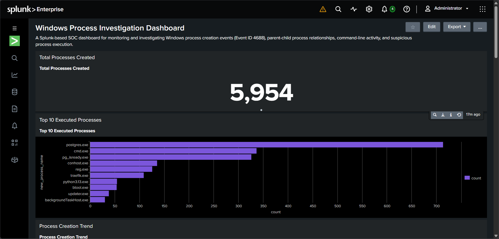
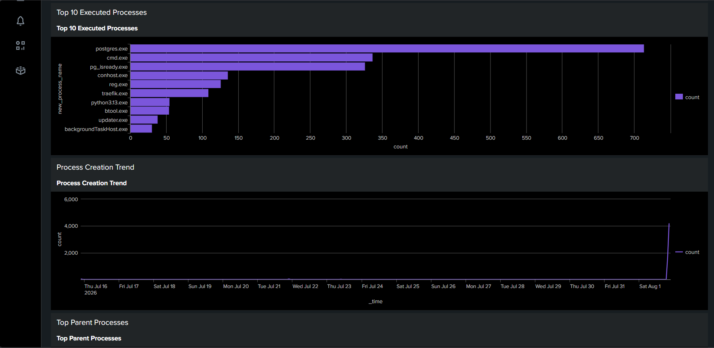
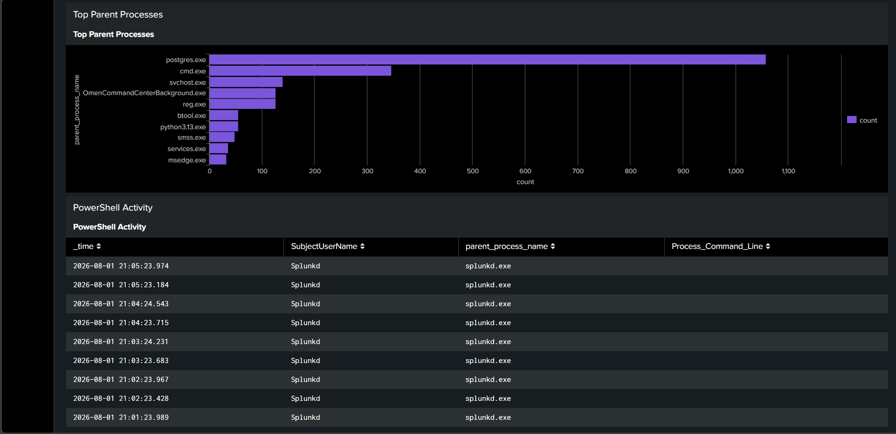
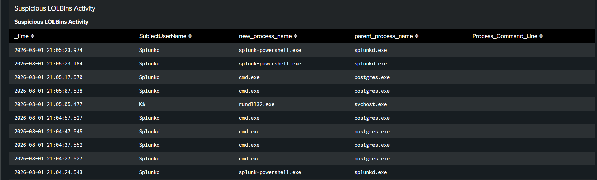

# Windows Process Investigation Dashboard



## Overview

The Windows Process Investigation Dashboard is a Splunk-based Security Operations Center (SOC) dashboard designed to monitor and investigate Windows Process Creation events (Event ID 4688).

The dashboard helps security analysts visualize process execution, parent-child process relationships, command-line activity, and commonly abused Windows binaries (LOLBins). It provides a centralized view for identifying suspicious process behavior and performing endpoint investigations.

---

## Tech Stack

- Splunk Enterprise 10.4
- SPL (Search Processing Language)
- Windows 11
- Windows Security Event Logs
- Event ID 4688
- Git & GitHub

---

## Features

- Monitor Windows Process Creation Events
- Top Executed Processes
- Process Creation Trend Analysis
- Parent Process Monitoring
- PowerShell Activity Monitoring
- CMD Activity Monitoring
- Recent Process Creation Events
- Suspicious LOLBins Detection

---

## Skills Demonstrated

- SIEM Monitoring
- Splunk Dashboard Development
- SPL Query Development
- Windows Event Log Analysis
- Process Investigation
- Parent-Child Process Analysis
- Threat Hunting
- Endpoint Monitoring

---

## Event ID Used

| Event ID | Description |
|----------|-------------|
| 4688 | Process Creation |

---

## Dashboard Panels

- Total Processes Created
- Top 10 Executed Processes
- Process Creation Trend
- Top Parent Processes
- PowerShell Activity
- CMD Activity
- Recent Process Creation Events
- Suspicious LOLBins Activity

---
## Dashboard Panels

| Panel | Purpose |
|-------|---------|
| **Total Processes Created** | Displays the total number of Windows Process Creation (Event ID 4688) events collected by Splunk, providing a quick overview of endpoint activity. |
| **Top 10 Executed Processes** | Identifies the most frequently executed processes to establish a baseline and highlight unusual applications. |
| **Process Creation Trend** | Visualizes process creation events over time, helping analysts identify spikes or abnormal activity. |
| **Top Parent Processes** | Shows which parent processes are spawning the most child processes, supporting parent-child process analysis. |
| **PowerShell Activity** | Monitors PowerShell executions, including parent processes and command-line activity, for investigation of potentially malicious scripts. |
| **CMD Activity** | Tracks Command Prompt execution to identify interactive shell usage and potential attacker activity. |
| **Recent Process Creation Events** | Displays the latest process creation events with user, process name, parent process, and command line for quick investigations. |
| **Suspicious LOLBins Activity** | Detects execution of commonly abused Windows Living-off-the-Land Binaries (LOLBins) such as PowerShell, CMD, Rundll32, Regsvr32, Mshta, and Certutil. |
## Dashboard Screenshots

### Dashboard Overview


### Top Processes



### Process Trend


### Parent Processes



### Suspicious Process Activity



---

## Project Structure

```
Splunk-Windows-Process-Investigation-Dashboard/
│
├── README.md
├── LICENSE
├── screenshots/
├── queries/
├── investigation/
└── resume/
```

---

## Key Learnings

- Learned Windows Process Creation Monitoring.
- Built multiple SPL queries for process investigation.
- Investigated parent-child process relationships.
- Monitored PowerShell and CMD activity.
- Detected commonly abused Windows LOLBins.
- Developed an interactive SOC dashboard using Splunk.

---

### Key SPL Queries

- Process Creation Monitoring (Event ID 4688)
- Parent Process Analysis
- PowerShell Activity Monitoring
- LOLBins Detection

---

## Skills Gained

- Windows Security Event Analysis
- Process Investigation
- Parent-Child Process Analysis
- Splunk Dashboard Development
- SPL Query Writing
- Endpoint Monitoring

---

## Future Improvements

- Process Tree Visualization
- MITRE ATT&CK Mapping
- Risk Score Dashboard
- Real-time Splunk Alerts
- Email Notifications
- Interactive Dashboard Filters

---

## Author

GitHub: https://github.com/kencryptic
